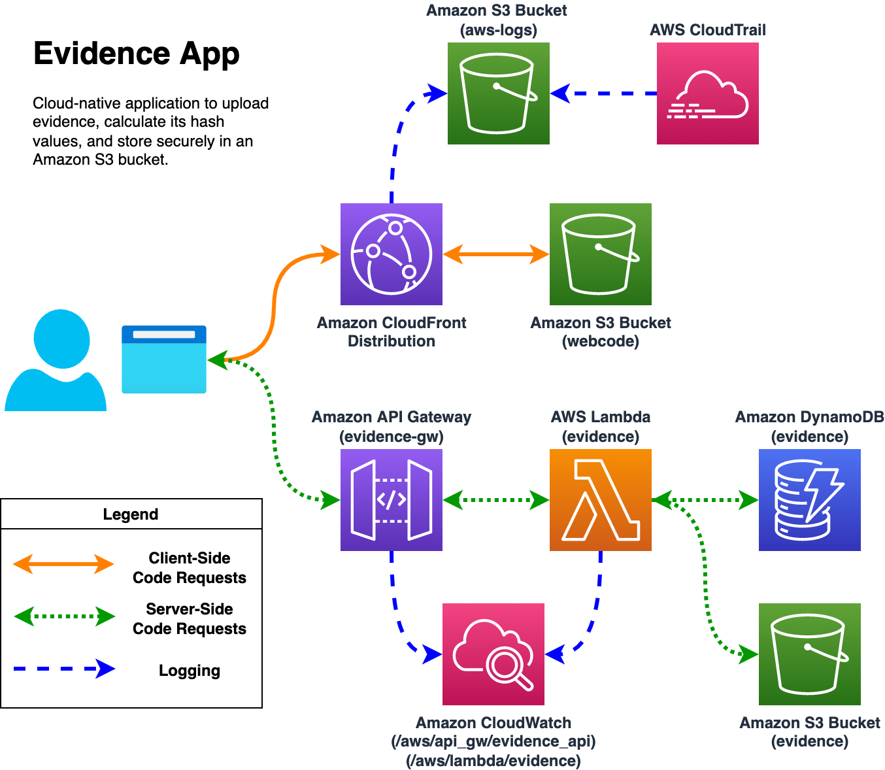
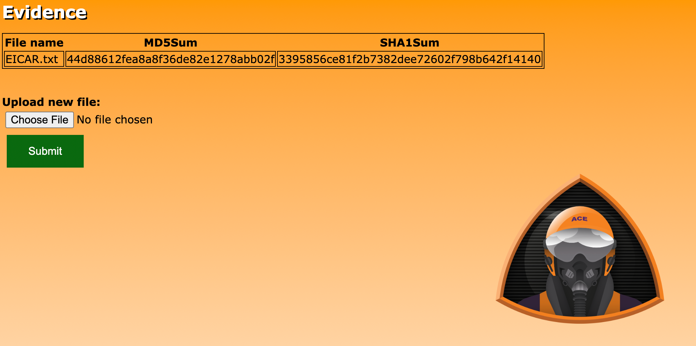

# Evidence App

## Description

This serverless web application is used by Sherlock's blue team to import evidence data, generate MD5 and SHA1 hashes of the uploaded files, and save the files in a safe location.

## Application Diagram



## Deployment

1. Pre-requisistes:

    - [Terraform 1.2.2+](https://www.terraform.io/downloads)

    - [AWS Command Line Interface](https://docs.aws.amazon.com/cli/latest/userguide/getting-started-install.html)

    - [Git](https://git-scm.com/downloads)

    - Command-line environment (e.g., Windows Terminal, macOS Terminal, AWS CloudShell)

2. Clone this repository to your local system/CloudShell and `cd` to the newly-cloned directory.

    ```bash
    git clone https://github.com/bluemountaincyber/evidence-app.git
    cd evidence-app
    ```

3. Use Terraform to initialize and deploy the included Infrastructure as Code (IaC). The deployment should take around 5 minutes.

    ```bash
    terraform init
    terraform apply # Answer 'yes' when prompted
    ```

## Using the Application

1. Navigate to the URL shown in your terminal at the end of the deployment (e.g., `https://d16krrq07nhrmy.cloudfront.net`).

2. When you arrive, you will find a table containing a sample evidence file name (`EICAR.txt`), MD5 hash (`44d88612fea8a8f36de82e1278abb02f`), and SHA1 hash (`3395856ce81f2b7382dee72602f798b642f14140`).

    

3. If you wish to add your own files to the evidence app, click the **Choose File** button, select your file to upload, and click the **Submit** button.

    - Upon upload the file will be stored in an Amazon S3 bucket in your account which begins with the prefix **evidence-**.

    - The metadata (file name, MD5 hash, and SHA1 hash) is generated and stored in an Amazon DynamoDB table called **evidence**.
