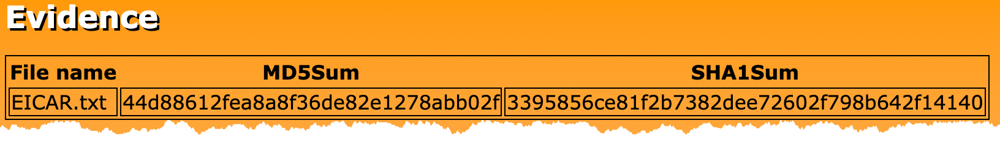
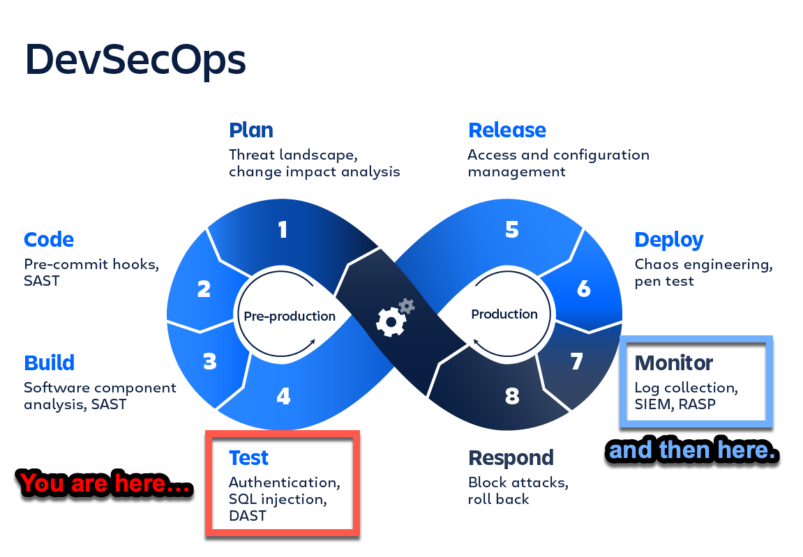
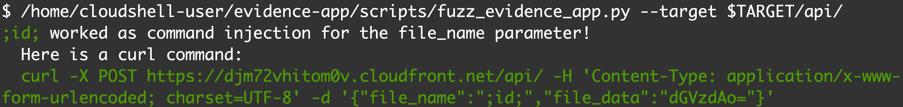
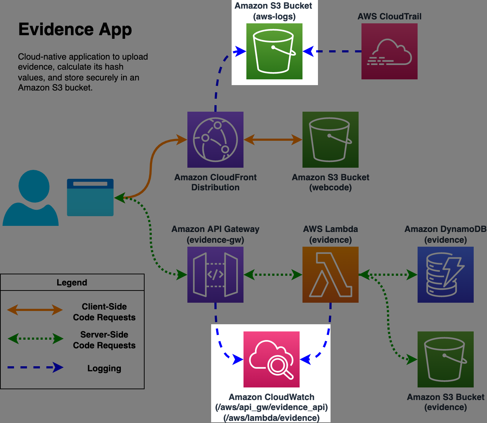
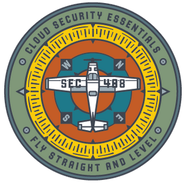

<!-- markdownlint-disable MD001 MD004 MD007 MD012 MD024 MD026 MD033 MD034-->

# Attacking and Defending Serverless Applications Workshop


<p class=author>Ryan Nicholson</p>
<p class=author-info>SEC488/SEC541 Author and Instructor</p>

---

# Agenda (1/2)

* Evidence-App Overview
    - **Exercise 1: Deploying the Serverless Application**

* Serverless ATT&CK Techniques
    - **Exercise 2: Reconnaissance of Evidence-App**
    - **Exercise 3: Discovering Evidence-App Vulnerability**
    - **Exercise 4: Exploiting Evidence-App and Pivoting to Cloud Account**

---

# Agenda (2/2)

- Investigating Serverless ATT&CK techniques
    - **Exercise 5: Identifying Reconnaissance**
    - **Exercise 6: Identifying Vulnerability Discovery**
    - **Exercise 7: Identifying Exploitation and Pivot**

* Conclusion
    - **Exercise 8: Tearing Down Serverless Application**

---

# Evidence-App Overview

- _This serverless web application is used by Sherlock's blue team to import evidence data, generate MD5 and SHA1 hashes of the uploaded files, and save the files in a safe location._



- Source Code: [https://github.com/bluemountaincyber/evidence-app](https://github.com/bluemountaincyber/evidence-app)

---


---



---

# So... what's in that repo?

- **EVERYTHING** as Code
    * Application **Source Code** (`HTML`, `CSS`, `JavaScript`, and `Python 3`)
    * **Infrastructure as Code (IaC)** to build cloud resources and deploy application (`Terraform`)
    * **Exercise documentation** for this workshop (`mkdocs`)
        - In case you want to work on this afterwards or share with your friends/co-workers
    * This presentation (`marp`)

* **LOTS** of opportunity for a coding mistake...

---

# Deploying the Evidence-App

From **AWS CloudShell**:

* Install Terraform:

    ```bash
    wget https://releases.hashicorp.com/terraform/1.2.4/terraform_1.2.4_linux_amd64.zip
    unzip -d /home/cloudshell-user/.local/bin/ /home/cloudshell-user/terraform.zip
    ```

* Execute Terraform:

  ```bash
  git clone https://github.com/bluemountaincyber/evidence-app.git
  cd /home/cloudshell-user/evidence-app
  terraform init
  terraform apply
  ```

---

# Now It's Your Turn!

### https://attack-defend-serverless.sanscloudwars.com

## Complete _Exercise 1_ and then STOP!


---


- _MITRE ATT&CK® is a globally-accessible knowledge base of adversary tactics and techniques based on real-world observations_
- Tactics include:

<table style="text-align: center;">
<tr>
  <td style="background-color: #ff5500;">Reconnaissance</td>
  <td style="background-color: transparent;">Privilege Escalation</td>
  <td style="background-color: transparent;">Collection</td>
</tr>
<tr>
  <td style="background-color: transparent;">Resource Development</td>
  <td style="background-color: transparent;">Defense Evasion</td>
  <td style="background-color: transparent;">Command and Control</td>
</tr>
<tr>
  <td style="background-color: #ff5500;">Initial Access</td>
  <td style="background-color: #ff5500;">Credential Access</td>
  <td style="background-color: transparent;">Exfiltration</td>
</tr>
<tr>
  <td style="background-color: #ff5500;">Execution</td>
  <td style="background-color: #ff5500;">Discovery</td>
  <td style="background-color: #ff5500;">Impact</td>
</tr>
<tr>
  <td style="background-color: transparent;">Persistence</td>
  <td style="background-color: transparent;">Lateral Movement</td>
  <td style="background-color: transparent;"></td></tr>
</table>

---


You will leverage and analyze common ATT&CK techniques

<div style="width: 95%;">
  <div style="width: 65%; float: left;">
    <ul>
      <li><b>Active Scanning (T1595)</b></li>
      <li><b>Cloud Infrastructure Discovery (T1580)</b></li>
      <li><b>Exploit Public-Facing Application (T1190)</b></li>
      <li><b>Command and Scripting Interpreter: Unix Shell (T1059.003)</b></li>
      <li><b>Unsecured Credentials (T1552)</b></li>
      <li><b>Data Destruction (T1485)</b></li>
      <li><b>Defacement: External Defacement (T1491.002)</b></li>
    </ul>
  </div>
  <div style="width: 33%; float: right;">
    
  </div>
</div>

---

# Custom Tooling

- Custom Python script to **fuzz** this application
    - `/home/cloudshell-user/evidence-app/scripts/fuzz_evidence_app.py`
- Tests popular command injection payloads
    - [https://github.com/payloadbox/command-injection-payload-list](https://github.com/payloadbox/command-injection-payload-list)



---

# Attack Sequence

1. Use application as a _normal_ user would
2. **Spider** web application
3. **Interact** with and learn more about newly-discovered endpoints
4. **Fuzz** the application to discover **command injection**
5. Use **remote code execution** to uncover cloud credentials
6. **Pivot** to cloud account and perform **discovery**
7. Be extra evil by **destroying data** and **defacing** the application

---

# Now It's Your Turn!

<br/>

## Complete _Exercise 2, 3, and 4_ and then STOP!

<br/>


---

# Investigating the Attack

* **Web interactions** can be found in a few places:
    * **CloudFront** logs in `aws-logs` S3 bucket
    * **API Gateway** (requests to `/api`) logs in `/aws/api_gw/evidence_api` CloudWatch log group
* Server-side execution data (Lambda) found in `/aws/lambda/evidence` CloudWatch log group
* API calls by stolen credentials found in `aws-logs` S3 bucket
    * **S3 data events** also enabled and stored here
* **AWS CLI** and **Linux Kung-Fu** for the win!

---



---

# Now It's Your Turn!

<br/>

## Complete Exercise _5, 6, and 7_ and then STOP!

<br/>


---

# Conclusion

You did a **LOT** in this workshop by attacking and detecting:

- **Active Scanning (T1595)**
- **Cloud Infrastructure Discovery (T1580)**
- **Exploit Public-Facing Application (T1190)**
- **Command and Scripting Interpreter: Unix Shell (T1059.003)**
- **Unsecured Credentials (T1552)**
- **Data Destruction (T1485)**
- **Defacement: External Defacement (T1491.002)**

---

# Now It's Your Turn!

## Complete _Exercise 8_ and... you're done!

<p style="text-align: center;">Thanks for attending and please feel free to ask any questions!</p>
<br/>
<div style="width: 95%;">
  <div style="width: 50%; float: left;">
    
  </div>
  <div style="width: 50%; float: right">
    
  </div>
</div>
