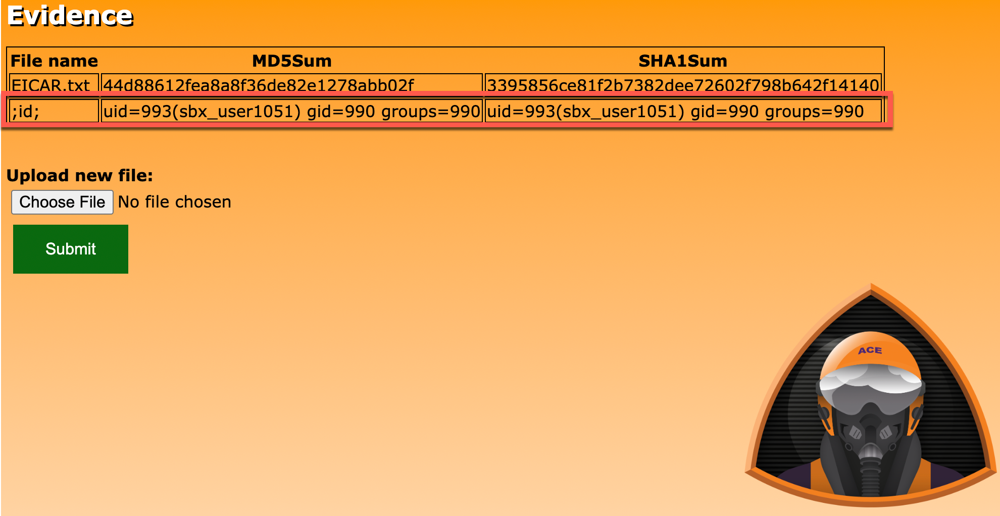

# Exercise 3: Discovering Evidence-App Vulnerability

<!-- markdownlint-disable MD033-->

<!--Overriding style-->
<style>
  :root {
    --sans-primary-color: #ff0000;
}
</style>

**Estimated Time to Complete:** 15 minutes

## Objectives

* Interact with **evidence-app** using your web browser, but this time use **Developer tools** to see what the submission looks like
* Fuzz the application by altering the `POST` payload sent to the application and review the results
* Review the source code to see where the vulnerability lies

## Challenges

### Challenge 1: Interact With Evidence-App (Again)

Instead of simply uploading another file, enable Developer tools in your web browser and see what the upload payload looks like when `/api/` is communicated with.

!!! note

    There is a walkthrough for some of the more common web browsers. If you use a different web browser than what is listed, research how to enable developer tools and how to view raw requests.

??? cmd "Solution - Google Chrome/Brave"

    1. Go to the browser tab with the evidence-app homepage. Again, if you closed it, you can recover the URL by running the following in your **CloudShell** session:

        ```bash
        echo $TARGET
        ```

        !!! summary "Expected Results"

            ```bash
            https://d1dw3pytnie47k.cloudfront.net
            ```

    2. Open Developer tools for this tab by either pressing `F12` or clicking on the triple dots in the top-right of the browser (1), hovering over **More tools** (2), and clicking on **Developer Tools** (3).

        {: class="w600" }

    3. A new pane should open on the right. To prepare for reviewing client and server communication, click on the **Network** tab.

        {: class="w600" }

    4. Upload another file as you did in **Exercise 2, Challenge 1**. Click on the **Choose File** button (1) and select a file of your choice (2).

        {: class="w600" }

        {: class="w500" }

    5. Click the **Submit** button (1). Click on the **OK** button in the alert popup (2). After a few moments, the file will be hashed and the results loaded on the page (3).

        {: class="w600" }

        {: class="w400" }

        {: class="w600" }

    6. In the **Developer Tools** pane, you should see two requests to `/api/`. The first is the `POST` request (the file upload) and the second is the `GET` request (refreshing the table on the web page). Click on the first request to `/api/` (1) and then, when a new pane opens, click on **Payload** (2).

        {: class="w600" }

    7. If you look closely at the **Form Data**, what is being submitted to `/api/` is a JSON object with two fields: `file_data` and `file_name`. The first (`file_data`) contains base64-encoded file contents and `file_name` is the name of the file submitted.

??? cmd "Solution - Firefox"

### Challenge 2: Fuzz Evidence-App

Being a web application, we would likely want to spend a decent amount of time performing attempts to uncover the [OWASP Top 10 web vulnerabilities](https://owasp.org/www-project-top-ten/). We do not have that kind of time in this workshop so we will focus on one in particular: **Injection**. Using the `POST` data that was discovered when interacting with the application, see if you can fuzz either one of the `POST` variables and see if the application responds unexpectedly.

??? cmd "Solution"

    1. As you are uploading data (file contents and file name) via the evidence-app, it is processed somewhere along the line and a hash of the data is generated, stored somewhere, and presented to the user via the web page. You are going to try to hijack the hashing process.

    2. To hijack this process, you will try to manipulate the data that is `POST`ed to the application. You have two choices, the `file_name` value or the `file_data` value. Let's start with `file_name`.

    3. You can fuzz an application with many different types of values, but, in the interest of time, let's see if we can fuzz the application with some command injection attempts. If you look [here](https://github.com/payloadbox/command-injection-payload-list) you will find a nice list of command injection payloads that you can set as the `file_name` value. This would take quite a while to do manually, so, like many useful techniques, there's a script for that located at `/home/cloudshell-user/scripts/fuzz_evidence_app.py`.

        ```bash
        /home/cloudshell-user/evidence-app/scripts/fuzz_evidence_app.py
        ```

        !!! summary "Expected Results"

            ```bash
            usage: fuzz_evidence_app.py [-h] --target CLOUDFRONT_URL
            fuzz_evidence_app.py: error: the following arguments are required: --target
            ```

    4. Notice that the `fuzz_evidence_app.py` requires a single parameter: `--target`. Since you are going to be fuzzing the `/api/` endpoint of the CloudFront distribution, set the `--target` flag to `$TARGET/api/`.

        ```bash
        /home/cloudshell-user/evidence-app/scripts/fuzz_evidence_app.py --target $TARGET/api/
        ```

        !!! summary "Expected Results"

            ```bash
            ;id; worked as command injection for the file_name parameter!
              Here is a curl command:
              curl -X POST https://d3d7nz3kb2bgwk.cloudfront.net/api/ -H 'Content-Type: application/x-www-form-urlencoded; charset=UTF-8' -d '{"file_name":";id;","file_data":"dGVzdAo="}'
            ```

    5. The script is telling you that command inject worked! But how was it able to tell this? Simple:
    
        * Loop through some common command injection payloads which are set to the `file_name` parameter's value.
        * Set the `file_data` to `dGVzdAo=`.
        * Check the result. 
            * If no result, there was probably a server-side error we cannot see.
            * If there is a result, but the `MD5` or `SHA1` hashes returned match what is expected when submitting this file's `file_data`, command injection did not work. 
            * If something else is returned, we caused the application to behave in an unexpected manner.

    6. Take a look at the evidence-app's homepage again by switching back to the browser tab and clicking the **Refresh** button.

        {: class="w600" }

    7. Notice something odd? We see under the **File Name** column the command injection value (`;id;`) and, instead of MD5 and SHA1 hash values, we see the output of the `id` command!

    8. The `id` command returns information about the user on the server-side system that executed that command. So who is `sbx_user1051` (your username may vary)? That is a well-known username format used in **AWS Lambda Functions**. Looks like we hijacked a function!

### Challenge 3: Source Code Review

How was it possible that you could run system commands by submitting a simple `POST` request? There was a command injection flaw in the code. The function code is available to you in the `/home/cloudshell-user/evidence-app/evidence.py.tpl` file. Can you find the line(s) which need to be addressed to prevent this type of exploitation?

??? cmd "Solution"

    1. Review the source code by running the following command in your **CloudShell** session:

        ```bash
        cat /home/cloudshell-user/evidence-app/evidence.py.tpl
        ```

        !!! summary "Expected Result"

            ```python
            """
            evidence AWS Lambda function code
            """

            import json
            import base64
            import os
            import boto3

            def get_evidence():
                """
                When GET request is made to function, return all entries in evidence DynamoDB table.
                """

                client = boto3.client('dynamodb')
                results = client.scan(TableName="evidence")
                return {
                    'statusCode': 200,
                    'body': str(results)
                }

            def post_evidence(event: dict):
                """
                When POST request is made to function, upload data to S3 and write hash values to
                evidence DynamoDB table.
                """

                req_body = json.loads(base64.b64decode(event["body"]))

                # Write file to S3
                client = boto3.client('s3')
                client.put_object(
                    Body = base64.b64decode(req_body["file_data"]),
                    Bucket = "${bucket}",
                    Key = req_body["file_name"]
                    )

                # Determine hashes
                filename = "/tmp/" + req_body["file_name"]
                temp_file = open(filename, "wb")
                temp_file.write(base64.b64decode(req_body["file_data"]))
                temp_file.close()

                md5_sum = os.popen("md5sum " + filename).read().split("  ")[0]
                sha1_sum = os.popen("sha1sum " + filename).read().split("  ")[0]

                # Write results to database
                client = boto3.client('dynamodb')
                client.put_item(
                    TableName='evidence',
                    Item={
                        'FileName': {
                            'S': req_body["file_name"]
                        },
                        'MD5Sum': {
                            'S': md5_sum
                        },
                        'SHA1Sum': {
                            'S': sha1_sum
                        }
                    }
                )

                return {
                    'statusCode': 200,
                    'body': "Success"
                }

            # pylint: disable=unused-argument
            def lambda_handler (event, context):
                """
                Entrypoint for AWS Lambda Function - evidence
                """

                request_method = event['requestContext']['httpMethod']
                if request_method == "GET":
                    response = get_evidence()
                elif request_method == "POST":
                    response = post_evidence(event)
                else:
                    response = {
                        'statusCode': 403,
                        'body': "Unauthorized HTTP Method: " + request_method
                    }
                return response
            ```
        
    2. It is important to know that, when you are writing Lambda functions, there is going to be a main function that is executed when the function is triggered. A common name for this initial function is `lambda_handler`. That is what is being used in this application (but could have been anything - you would need to look at the Lambda resource configuration to acquire the handler function name).

    3. If you look at the last method (`def lambda_handler (event, context)`), that is the entrypoint to the function that, when triggered, execution begins.

    4. When this function is triggered (in this case, by an **API Gateway**), `event` information is passed. This information would include such things as what the HTTP method was when communicating with the API Gateway and also what the payload was if any was sent. This is all included in the `event` variable.

    5. At the beginning of the method's code, you can see references to this `event` variable: determining what the HTTP method was (`request_method = event['requestContext']['httpMethod']`) and, based upon if it were a `GET` or `POST`, triggering another method. In our case, since we were submitting `POST` requests to the application to execute our attacker-controlled commands, let's take a look at the `post_evidence` method.

    6. If you scroll up a bit and read through the lines following `def post_evidence(event: dict):`, you will find where the security hole is:

        ```python
        md5_sum = os.popen("md5sum " + filename).read().split("  ")[0]
        sha1_sum = os.popen("sha1sum " + filename).read().split("  ")[0]
        ``` 

    7. At a high level, what these two lines of code are doing is taking whatever is sent as the `file_name` parameter's value, inserting it into a system command, and returning the result. In our case, we were sending in `;id;` so the two system commands would be:

        ```bash
        md5sum ;id;
        sha1sum ;id;
        ```

    8. In `bash`, you can use semicolons to terminate a command and initiate a new one. That is what is happening here. Both the `md5sum` and `sha1sum` commands are terminated prematurely and the `id` command is being executed - returning the AWS Lambda function's user information.

## ATT&CK

MITRE ATT&CK techniques performed:

| Tactic         | Technique                                                 | Description |
|:---------------|:----------------------------------------------------------|:------------|
| Initial Access | Exploit Public-Facing Application (T1190)                 | Used `fuzz_evidence_app.py` to fuzz the application |
| Execution      | Command and Scripting Interpreter: Unix Shell (T1059.003) | Found remote code execution                         |
