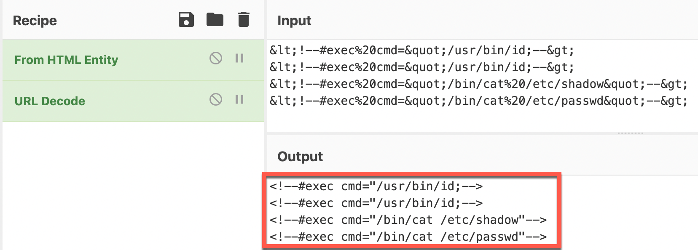

# Exercise 6: Identifying Vulnerability Discovery

<!-- markdownlint-disable MD007 MD033-->

<!--Overriding style-->
<style>
  :root {
    --sans-primary-color: #0000ff;
}
</style>

**Estimated Time to Complete:** 15 minutes

## Objectives

* Locate API access log data in CloudWatch
* Use CloudWatch Logs Insights to identify possible fuzzing from suspect IP
* Dig deeper into API logs to find some of the attack payloads attempted (that ultimately failed)

## Challenges

### Challenge 1: Locate API Access Log Data

As you saw in the last exercise, the suspect IP address was communicating with the `/api/` quite a lot in a short amount of time. When visiting that endpoint, the client traffic is forwarded to an API Gateway resource. Find the appropriate log data related to API Gateway activity and determine its schema in AWS CloudWatch.

??? cmd "Solution"

    1. To view all log groups in AWS CloudWatch, you can use the following CLI command:

        ```bash
        aws logs describe-log-groups
        ```

        !!! summary "Sample Results"

            ```bash
            {
                "logGroups": [
                    {
                        "logGroupName": "/aws/api_gw/evidence_api",
                        "creationTime": 1658146688502,
                        "retentionInDays": 1,
                        "metricFilterCount": 0,
                        "arn": "arn:aws:logs:us-east-1:206757820151:log-group:/aws/api_gw/evidence_api:*",
                        "storedBytes": 0
                    },
                    {
                        "logGroupName": "/aws/lambda/evidence",
                        "creationTime": 1658146708979,
                        "retentionInDays": 1,
                        "metricFilterCount": 0,
                        "arn": "arn:aws:logs:us-east-1:206757820151:log-group:/aws/lambda/evidence:*",
                        "storedBytes": 0
                    },
                    {
                        "logGroupName": "cloudtrail-vmjmgvts6lxfrf22",
                        "creationTime": 1658146687965,
                        "retentionInDays": 1,
                        "metricFilterCount": 0,
                        "arn": "arn:aws:logs:us-east-1:206757820151:log-group:cloudtrail-vmjmgvts6lxfrf22:*",
                        "storedBytes": 0
                    }
                ]
            }
            ```

    2. If you look closely at each line beginning with `logGroupName`, one sticks out: `/aws/api_gw/evidence_api`. In fact, all log groups capturing API Gateway traffic data will begin with `/aws/api_gw/`.

    3. To determine the schema, we could of course look at [AWS' documentation](https://docs.aws.amazon.com/apigateway/latest/developerguide/set-up-logging.html), but since this log data, as you will see, is in JSON format, the data more or less describes itself.

    4. To view log entries, you must indicate which log stream (within the `/aws/api_gw/evidence_api` log group) the data resides in. You can list the available streams like so:

        ```bash
        aws logs describe-log-streams --log-group-name /aws/api_gw/evidence_api
        ```

        !!! summary "Sample Results"

            ```bash
            {
                "logStreams": [
                    {
                        "logStreamName": "log_stream_created_by_aws_to_validate_log_delivery_subscriptions",
                        "creationTime": 1658146688901,
                        "firstEventTimestamp": 1658146688912,
                        "lastEventTimestamp": 1658146688912,
                        "lastIngestionTime": 1658146688916,
                        "uploadSequenceToken": "49039859511763443492676233544510674742969342109675099294",
                        "arn": "arn:aws:logs:us-east-1:206757820151:log-group:/aws/api_gw/evidence_api:log-stream:log_stream_created_by_aws_to_validate_log_delivery_subscriptions",
                        "storedBytes": 0
                    },
                    {
                        "logStreamName": "r0mx7qm4bi_api-2022-07-18-12-33",
                        "creationTime": 1658147639106,
                        "firstEventTimestamp": 1658147619982,
                        "lastEventTimestamp": 1658147619982,
                        "lastIngestionTime": 1658147639124,
                        "uploadSequenceToken": "49039859511764706535751652337852435779136233393628453130",
                        "arn": "arn:aws:logs:us-east-1:206757820151:log-group:/aws/api_gw/evidence_api:log-stream:r0mx7qm4bi_api-2022-07-18-12-33",
                        "storedBytes": 0
                    },
                    {
                        "logStreamName": "r0mx7qm4bi_api-2022-07-18-12-34",
                        "creationTime": 1658147666899,
                        "firstEventTimestamp": 1658147641268,
                        "lastEventTimestamp": 1658147671195,
                        "lastIngestionTime": 1658147704482,
                        "uploadSequenceToken": "49039859511764793411435000848384057422330731216904803152",
                        "arn": "arn:aws:logs:us-east-1:206757820151:log-group:/aws/api_gw/evidence_api:log-stream:r0mx7qm4bi_api-2022-07-18-12-34",
                        "storedBytes": 0
                    }
                ]
            }
            ```

    5. To list a few log entries, you can run the following commands to extract the second available log stream name (the first is used by AWS to test delivery of the data to CloudWatch) and then get the events of that stream:

        ```bash
        STREAM=$(aws logs describe-log-streams --log-group-name /aws/api_gw/evidence_api --query 'logStreams[1].logStreamName' --output text)
        aws logs get-log-events --log-group-name /aws/api_gw/evidence_api --log-stream-name $STREAM
        ```

        !!! summary "Sample Results"

            ```bash
            {
                "events": [
                    {
                        "timestamp": 1658147619982,
                        "message": "{\"httpMethod\":\"GET\",\"integrationErrorMessage\":\"-\",\"protocol\":\"HTTP/1.1\",\"requestId\":\"Vdntpho8IAMEVSQ=\",\"requestTime\":\"18/Jul/2022:12:33:39 +0000\",\"resourcePath\":\"-\",\"responseLength\":\"607\",\"routeKey\":\"ANY /\",\"sourceIp\":\"107.21.85.89\",\"status\":\"200\"}",
                        "ingestionTime": 1658147639124
                    },
                    {
                        "timestamp": 1658147639029,
                        "message": "{\"httpMethod\":\"GET\",\"integrationErrorMessage\":\"-\",\"protocol\":\"HTTP/1.1\",\"requestId\":\"VdnwojmSoAMEVHA=\",\"requestTime\":\"18/Jul/2022:12:33:59 +0000\",\"resourcePath\":\"-\",\"responseLength\":\"607\",\"routeKey\":\"ANY /\",\"sourceIp\":\"107.21.85.89\",\"status\":\"200\"}",
                        "ingestionTime": 1658147667963
                    }
                ],
                "nextForwardToken": "f/36977927999530860644098179687600231948455474840454758400/s",
                "nextBackwardToken": "b/36977927574768566847685400675904898060423196092934324224/s"
            }
            ```

    6. The results are a little cryptic, but for each event, you can see there are `timestamp`, `message`, and `ingestTime` fields. However, it appears that there is some nested JSON data in the `message` field that we can do a better job to visualize using `jq`.

        ```bash
        aws logs get-log-events --log-group-name /aws/api_gw/evidence_api --log-stream-name $STREAM | \
          jq '.events[].message | fromjson'
        ```

        !!! summary "Sample Results"

            ```bash
            {
            "httpMethod": "GET",
            "integrationErrorMessage": "-",
            "protocol": "HTTP/1.1",
            "requestId": "Vdntpho8IAMEVSQ=",
            "requestTime": "18/Jul/2022:12:33:39 +0000",
            "resourcePath": "-",
            "responseLength": "607",
            "routeKey": "ANY /",
            "sourceIp": "107.21.85.89",
            "status": "200"
            }
            {
            "httpMethod": "GET",
            "integrationErrorMessage": "-",
            "protocol": "HTTP/1.1",
            "requestId": "VdnwojmSoAMEVHA=",
            "requestTime": "18/Jul/2022:12:33:59 +0000",
            "resourcePath": "-",
            "responseLength": "607",
            "routeKey": "ANY /",
            "sourceIp": "107.21.85.89",
            "status": "200"
            }
            ```

    7. Now, you can see some nested fields:

        * `httpMethod`: The HTTP method used when requesting `/api/`
        * `integrationErrorMessage`: If an error occured, what the message is
        * `protocol`: The HTTP protocol version the client used
        * `requestId`: A unique identifier for each API Gateway interaction (we saw this during the attack when issuing the `HEAD` request to `/api/`)
        * `requestTime`: The time of the request
        * `responseLength`: The amount of data, in bytes, returned to the client
        * `routeKey`: The route configuration used by the API Gateway resource
        * `sourceIp`: The source IP address
        * `status`: The HTTP status

### Challenge 2: Use CloudWatch Insights to Find Fuzzing Attempts

Armed with this new data and an understanding of its available fields, craft AWS CloudWatch Logs Insights queries to identify possible fuzzing of the application.

??? cmd "Solution"

    1. Let's being by launching a really basic query which will be extended to identify the possible fuzzing by the suspect IP address. List all of the log entries by executing the following commands in your **CloudShell** session:

        !!! note

            Unlike using the AWS Management Console, these commands are in two parts: execution and retrieval. That is why you will see the first (very long) command execute the query and save the query ID. The query ID is needed in the second command to retrieve the results from the correct query.

            There is also a little command-line Kung Fu to grab data from the previous three hours.

        ```bash
        QUERY_ID=$(aws logs start-query --start-time $(date -d '-3 hours' "+%s") \
          --end-time $(date "+%s") \
          --query-string 'fields @timestamp, @message' \
          --log-group-name /aws/api_gw/evidence_api \
          --query 'queryId' --output text)
        aws logs get-query-results --query-id $QUERY_ID
        ```

        !!! warning

            If you see a message similar to the below message, that means the query is not finished.

            ```bash
            {
                "results": [],
                "statistics": {
                    "recordsMatched": 0.0,
                    "recordsScanned": 0.0,
                    "bytesScanned": 0.0
                },
                "status": "Running"
            }
            ```
            
            Wait a few more seconds, hit the `up` arrow in your **CloudShell** session to bring up the last command, and hit `Enter`.

        !!! summary "Sample Results"

            ```bash
            {
                "results": [
                    [
                        {
                            "field": "@timestamp",
                            "value": "2022-07-18 12:34:31.195"
                        },
                        {
                            "field": "@message",
                            "value": "{\"httpMethod\":\"GET\",\"integrationErrorMessage\":\"-\",\"protocol\":\"HTTP/1.1\",\"requestId\":\"Vdn1pgs-oAMEVaA=\",\"requestTime\":\"18/Jul/2022:12:34:31 +0000\",\"resourcePath\":\"-\",\"responseLength\":\"2864\",\"routeKey\":\"ANY /\",\"sourceIp\":\"107.21.85.89\",\"status\":\"200\"}"
                        },
                        {
                            "field": "@ptr",
                            "value": "CmIKKQolMjA2NzU3ODIwMTUxOi9hd3MvYXBpX2d3L2V2aWRlbmNlX2FwaRAHEjUaGAIGK3IFAgAAAACMcA2dAAYtVTZwAAAEIiABKJuZtoqhMDCbmbaKoTA4AUCYAkjyDFCbBhAAGAE="
                        }
                    ],
                    [
                        {
                            "field": "@timestamp",
                            "value": "2022-07-18 12:34:30.964"
                        },
                        {
                            "field": "@message",
                            "value": "{\"httpMethod\":\"GET\",\"integrationErrorMessage\":\"-\",\"protocol\":\"HTTP/1.1\",\"requestId\":\"Vdn1ng7PIAMEVPw=\",\"requestTime\":\"18/Jul/2022:12:34:30 +0000\",\"resourcePath\":\"-\",\"responseLength\":\"2864\",\"routeKey\":\"ANY /\",\"sourceIp\":\"107.21.85.89\",\"status\":\"200\"}"
                        },
                        {
                            "field": "@ptr",
                            "value": "CmIKKQolMjA2NzU3ODIwMTUxOi9hd3MvYXBpX2d3L2V2aWRlbmNlX2FwaRACEjUaGAIF9f8OdQAAAAVVXBf2AAYtVTBAAAAHUiABKLuatYqhMDC0l7aKoTA4AkD3BUjCEFDqCRABGAE="
                        }
                    ],
            <snip>
            ```

    2. This data looks very similar to if we were to run the `aws logs get-log-events` command multiple times against all log streams inside the `/aws/api_gw/evidence_api` log group, but CloudWatch Logs Insights allows us to search **all** log streams at once (and even multiple log groups at once).
    
    3. Typically, when fuzzing is performed, many errors may be generated by the application. If you remember, there is a sub-field within the `@message` field called `integrationErrorMessage`. The following query will output any log entries where the `integrationErrorMessage` field does not equal `-` when the suspect IP address is behind the submission:

        ```bash
        QUERY_ID=$(aws logs start-query --start-time $(date -d '-3 hours' "+%s") \
          --end-time $(date "+%s") \
          --query-string 'fields integrationErrorMessage | filter integrationErrorMessage != "-"' and sourceIp == "'$SUSPECT'"' \
          --log-group-name /aws/api_gw/evidence_api \
          --query 'queryId' --output text)
        aws logs get-query-results --query-id $QUERY_ID
        ```

        !!! warning

            If you see a message similar to the below message, that means the query is not finished.

            ```bash
            {
                "results": [],
                "statistics": {
                    "recordsMatched": 0.0,
                    "recordsScanned": 0.0,
                    "bytesScanned": 0.0
                },
                "status": "Running"
            }
            ```
            
            Wait a few more seconds, hit the `up` arrow in your **CloudShell** session to bring up the last command, and hit `Enter`.

        !!! summary "Sample Results"

            ```bash
            {
                "results": [
                    [
                        {
                            "field": "integrationErrorMessage",
                            "value": "The Lambda function returned the following error: An error occurred (ValidationException) when calling the PutItem operation: One or more parameter values were invalid: Aggregated size of all range keys has exceeded the size limit of 1024 bytes. Check your Lambda function code and try again."
                        },
                        {
                            "field": "@ptr",
                            "value": "CmIKKQolMjA2NzU3ODIwMTUxOi9hd3MvYXBpX2d3L2V2aWRlbmNlX2FwaRACEjUaGAIF9f8OdQAAAAVVXeVqAAYtVTaQAAAHUiABKL3XtYqhMDC17LWKoTA4AkDQBkiKEVCyChABGAE="
                        }
                    ],
                    [
                        {
                            "field": "integrationErrorMessage",
                            "value": "The Lambda function returned the following error: An error occurred (ValidationException) when calling the PutItem operation: One or more parameter values are not valid. The AttributeValue for a key attribute cannot contain an empty string value. Key: MD5Sum. Check your Lambda function code and try again."
                        },
                        {
                            "field": "@ptr",
                            "value": "CmIKKQolMjA2NzU3ODIwMTUxOi9hd3MvYXBpX2d3L2V2aWRlbmNlX2FwaRABEjUaGAIF5f2FfQAAAAUgN99xAAYtVTYQAAAA0iABKMijtYqhMDDQlbaKoTA4AkDgBkijEVDLChAAGAE="
                        }
                    ],
                    [
                        {
                            "field": "integrationErrorMessage",
                            "value": "The Lambda function returned the following error: [Errno 2] No such file or directory: '/tmp/&lt;!--#exec%20cmd=&quot;/usr/bin/id;--&gt;'. Check your Lambda function code and try again."
                        },
                        {
                            "field": "@ptr",
                            "value": "CmIKKQolMjA2NzU3ODIwMTUxOi9hd3MvYXBpX2d3L2V2aWRlbmNlX2FwaRABEjUaGAIF5f2FfQAAAAUgNzcmAAYtVS+AAAAA0iABKI6Js4qhMDDrqLWKoTA4BkCwEUisFFDTDRAEGAE="
                        }
                    ],
                    [
                        {
                            "field": "integrationErrorMessage",
                            "value": "The Lambda function returned the following error: [Errno 2] No such file or directory: '/tmp/&lt;!--#exec%20cmd=&quot;/usr/bin/id;--&gt;'. Check your Lambda function code and try again."
                        },
                        {
                            "field": "@ptr",
                            "value": "CmIKKQolMjA2NzU3ODIwMTUxOi9hd3MvYXBpX2d3L2V2aWRlbmNlX2FwaRAEEjUaGAIF++x/MgAAAAfmNSfmAAYtVTVQAAABIiABKPeetYqhMDC/rrWKoTA4AkDmBUipEFDRCRAAGAE="
                        }
                    ],
                    [
                        {
                            "field": "integrationErrorMessage",
                            "value": "The Lambda function returned the following error: [Errno 2] No such file or directory: '/tmp/&lt;!--#exec%20cmd=&quot;/bin/cat%20/etc/shadow&quot;--&gt;'. Check your Lambda function code and try again."
                        },
                        {
                            "field": "@ptr",
                            "value": "CmIKKQolMjA2NzU3ODIwMTUxOi9hd3MvYXBpX2d3L2V2aWRlbmNlX2FwaRACEjUaGAIF9f8OdQAAAAVVXBf2AAYtVTBAAAAHUiABKLuatYqhMDC0l7aKoTA4AkD3BUjCEFDqCRAAGAE="
                        }
                    ],
                    [
                        {
                            "field": "integrationErrorMessage",
                            "value": "The Lambda function returned the following error: [Errno 2] No such file or directory: '/tmp/&lt;!--#exec%20cmd=&quot;/bin/cat%20/etc/passwd&quot;--&gt;'. Check your Lambda function code and try again."
                        },
                        {
                            "field": "@ptr",
                            "value": "CmIKKQolMjA2NzU3ODIwMTUxOi9hd3MvYXBpX2d3L2V2aWRlbmNlX2FwaRABEjUaGAIF5f2FfQAAAAUgNzcmAAYtVS+AAAAA0iABKI6Js4qhMDDrqLWKoTA4BkCwEUisFFDTDRADGAE="
                        }
                    ],
                    [
                        {
                            "field": "integrationErrorMessage",
                            "value": "The Lambda function returned the following error: argument should be a bytes-like object or ASCII string, not 'NoneType'. Check your Lambda function code and try again."
                        },
                        {
                            "field": "@ptr",
                            "value": "CmIKKQolMjA2NzU3ODIwMTUxOi9hd3MvYXBpX2d3L2V2aWRlbmNlX2FwaRABEjUaGAIF5f2FfQAAAAUgNzcmAAYtVS+AAAAA0iABKI6Js4qhMDDrqLWKoTA4BkCwEUisFFDTDRABGAE="
                        }
                    ],
                    [
                        {
                            "field": "@ptr",
                            "value": "CmIKKQolMjA2NzU3ODIwMTUxOi9hd3MvYXBpX2d3L2V2aWRlbmNlX2FwaRAAEjUaGAIGK4g4bAAAAABK9+tnAAYtVPFgAAAAwiABKJCf+omhMDCQn/qJoTA4AUCQAUiFB1C0AxAAGAE="
                        }
                    ]
                ],
                "statistics": {
                    "recordsMatched": 8.0,
                    "recordsScanned": 18.0,
                    "bytesScanned": 6420.0
                },
                "status": "Complete"
            }
            ```

    4. In the results, you should see a few reasons why the backend Lambda function failed:

        * The data being recorded in the DynamoDB backend database table was too large
        * A value for one of the DynamoDB keys was invalid
        * There is a file referenced by Lambda that cannot be found
        * The data being passed to the Lambda function was invalid

    5. Use this information to address the next challenge.

### Challenge 3: Gather Failed Attack Payloads

Finally, try to acquire some of the attack payloads used by the suspect IP using Logs Insights.

??? cmd "Solution"

    1. As you discovered in the previous challenge, there were four reasons why the API Gateway requests would fail. One of which was a file referenced by Lambda. A little insight into the Lambda function is that, when the `file_name` and `file_content` is received by the application, the function will create that file in the `/tmp` directory with the same name that was passed via the HTTP `POST` data and then the hashing will occur before storing the results in the DynamoDB table.

    2. If the attacker were to be fuzzing the application, they would likely choose one of the two `POST` parameter values since they can directly influence their values. If the `file_name` parameter were manipulated, we would possibly see the parameter value they chose in the error output.

    3. Craft one more AWS CloudWatch Logs Insights query to extract all of the error messages containing `No such file or directory`.

        ```bash
        QUERY_ID=$(aws logs start-query --start-time $(date -d '-3 hours' "+%s") \
          --end-time $(date "+%s") \
          --query-string 'fields integrationErrorMessage | filter integrationErrorMessage ~= "No such file or directory" and sourceIp == "'$SUSPECT'"' \
          --log-group-name /aws/api_gw/evidence_api \
          --query 'queryId' --output text)
        aws logs get-query-results --query-id $QUERY_ID
        ```

        !!! warning

            If you see a message similar to the below message, that means the query is not finished.

            ```bash
            {
                "results": [],
                "statistics": {
                    "recordsMatched": 0.0,
                    "recordsScanned": 0.0,
                    "bytesScanned": 0.0
                },
                "status": "Running"
            }
            ```
            
            Wait a few more seconds, hit the `up` arrow in your **CloudShell** session to bring up the last command, and hit `Enter`.

        !!! summary "Sample Results"

            ```bash
            {
                "results": [
                    [
                        {
                            "field": "integrationErrorMessage",
                            "value": "The Lambda function returned the following error: [Errno 2] No such file or directory: '/tmp/&lt;!--#exec%20cmd=&quot;/usr/bin/id;--&gt;'. Check your Lambda function code and try again."
                        },
                        {
                            "field": "@ptr",
                            "value": "CmIKKQolMjA2NzU3ODIwMTUxOi9hd3MvYXBpX2d3L2V2aWRlbmNlX2FwaRABEjUaGAIF5f2FfQAAAAUgNzcmAAYtVS+AAAAA0iABKI6Js4qhMDDrqLWKoTA4BkCwEUisFFDTDRAEGAE="
                        }
                    ],
                    [
                        {
                            "field": "integrationErrorMessage",
                            "value": "The Lambda function returned the following error: [Errno 2] No such file or directory: '/tmp/&lt;!--#exec%20cmd=&quot;/usr/bin/id;--&gt;'. Check your Lambda function code and try again."
                        },
                        {
                            "field": "@ptr",
                            "value": "CmIKKQolMjA2NzU3ODIwMTUxOi9hd3MvYXBpX2d3L2V2aWRlbmNlX2FwaRAEEjUaGAIF++x/MgAAAAfmNSfmAAYtVTVQAAABIiABKPeetYqhMDC/rrWKoTA4AkDmBUipEFDRCRAAGAE="
                        }
                    ],
                    [
                        {
                            "field": "integrationErrorMessage",
                            "value": "The Lambda function returned the following error: [Errno 2] No such file or directory: '/tmp/&lt;!--#exec%20cmd=&quot;/bin/cat%20/etc/shadow&quot;--&gt;'. Check your Lambda function code and try again."
                        },
                        {
                            "field": "@ptr",
                            "value": "CmIKKQolMjA2NzU3ODIwMTUxOi9hd3MvYXBpX2d3L2V2aWRlbmNlX2FwaRACEjUaGAIF9f8OdQAAAAVVXBf2AAYtVTBAAAAHUiABKLuatYqhMDC0l7aKoTA4AkD3BUjCEFDqCRAAGAE="
                        }
                    ],
                    [
                        {
                            "field": "integrationErrorMessage",
                            "value": "The Lambda function returned the following error: [Errno 2] No such file or directory: '/tmp/&lt;!--#exec%20cmd=&quot;/bin/cat%20/etc/passwd&quot;--&gt;'. Check your Lambda function code and try again."
                        },
                        {
                            "field": "@ptr",
                            "value": "CmIKKQolMjA2NzU3ODIwMTUxOi9hd3MvYXBpX2d3L2V2aWRlbmNlX2FwaRABEjUaGAIF5f2FfQAAAAUgNzcmAAYtVS+AAAAA0iABKI6Js4qhMDDrqLWKoTA4BkCwEUisFFDTDRADGAE="
                        }
                    ]
                ],
                "statistics": {
                    "recordsMatched": 4.0,
                    "recordsScanned": 18.0,
                    "bytesScanned": 6420.0
                },
                "status": "Complete"
            }
            ```

    4. There is just one more command to clean up the results of the query to extract the possible `file_name` parameter values that were used in the fuzzing attack. The command below uses the same query output but then post-processes the data with `jq`, `cut`, and `sed` to output just the `file_name` value submitted by the suspicious actor.

        ```bash
        aws logs get-query-results --query-id $QUERY_ID | jq -r '.results[][0].value' | cut -d "'" -f2 | sed 's/^\/tmp\///g'
        ```

        !!! summary "Expected Results"

            ```bash
            &lt;!--#exec%20cmd=&quot;/usr/bin/id;--&gt;
            &lt;!--#exec%20cmd=&quot;/usr/bin/id;--&gt;
            &lt;!--#exec%20cmd=&quot;/bin/cat%20/etc/shadow&quot;--&gt;
            &lt;!--#exec%20cmd=&quot;/bin/cat%20/etc/passwd&quot;--&gt;
            ```
    5. Since this output appears to be encoded as HTML entities, we can see what the decoded content would be in this case using a tool like [CyberChef](https://gchq.github.io/CyberChef/#recipe=From_HTML_Entity()URL_Decode()&input=Jmx0OyEtLSNleGVjJTIwY21kPSZxdW90Oy91c3IvYmluL2lkOy0tJmd0OwombHQ7IS0tI2V4ZWMlMjBjbWQ9JnF1b3Q7L3Vzci9iaW4vaWQ7LS0mZ3Q7CiZsdDshLS0jZXhlYyUyMGNtZD0mcXVvdDsvYmluL2NhdCUyMC9ldGMvc2hhZG93JnF1b3Q7LS0mZ3Q7CiZsdDshLS0jZXhlYyUyMGNtZD0mcXVvdDsvYmluL2NhdCUyMC9ldGMvcGFzc3dkJnF1b3Q7LS0mZ3Q7).

        {: class="w600" }

    6. It looks like these attempts were trying to use HTML comments. Keep in mind, these all failed. So which attempt was successful? Unfortunately, the API gateway logs do not give us insight into the successful submissions. Were there any successful submissions by the attacker after these failed attempts? Stay tuned to see if the attacker continued to be active in this cloud account.
