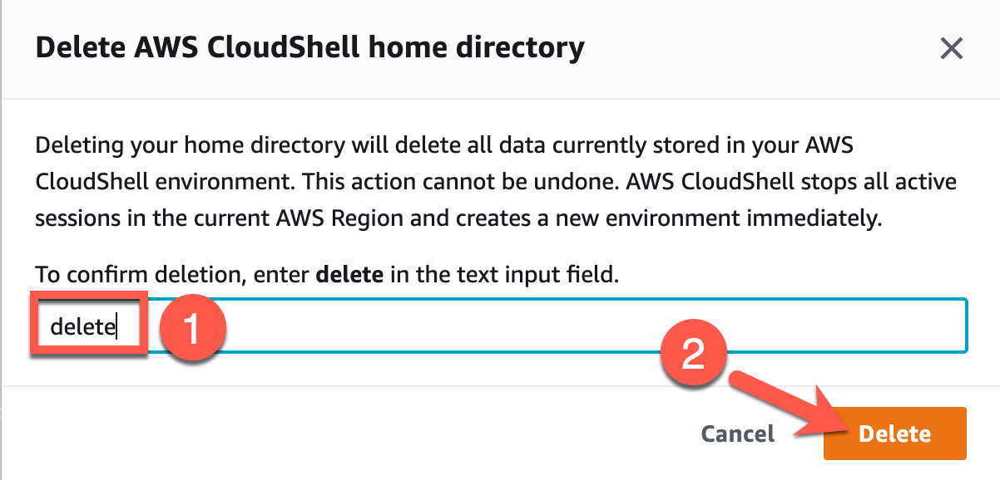

# Exercise 8: Tearing Down Serverless Application

**Estimated time to complete:** 5 minutes

## Objectives

* Tear down **evidence-app** resources using `cloudformation-teardown.sh`
* (Optional) Reset **CloudShell** home directory contents

## Challenges

### Challenge 1: Tear Down With Terraform

Log back into your **CloudShell** session and use `terraform` to destroy the **evidence-app** resources.

??? cmd "Solution"

    1. In your **CloudShell** session, run the following commands to destroy all **evidence-app** resources:

        ```bash
        cd /home/cloudshell-user/evidence-app
        ./cloudformation-teardown.sh
        ```

        !!! summary "Expected Results"

            ```bash
            Removing webcode_final directory...
            Emptying S3 buckets (1 of 2)...
            Tearing down CloudFormation Stack (1 of 2)...
            Emptying S3 buckets (2 of 2)...
            Tearing down CloudFormation Stack (2 of 2)...
            Teardown complete!
            ```

### Challenge 2: (Optional) Reset CloudShell Home Directory

Delete the contents of your **CloudShell** home directory.

??? cmd "Solution"

    1. In your **CloudShell session**, click on the **Actions** dropdown (1) and choose **Delete AWS CloudShell home directory** (2).

        {: class="w300" }

    2. When prompted, type `delete` in the text field (1) and click on the **Delete** button (2).

        {: class="w500" }

    3. Your **CloudShell** session should restart and your home directory will be set to default.
